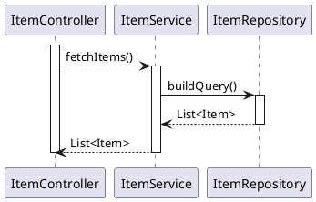
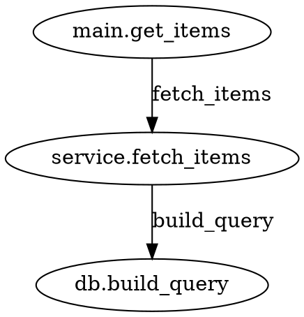

# codemole

**codemole** is a CLI tool that traces an API endpoint through your source code and generates sequence and class/flow diagrams.

---

## How it works

1. **Find** — Locates the endpoint handler in the codebase using framework-specific patterns (Spring annotations, FastAPI decorators, Gin route registrations).
2. **Traverse** — Performs a BFS walk of the call graph starting from that handler, following only calls that exist in *your* codebase. Symbols to skip (stdlib, framework helpers) are loaded from an SQLite database — extensible without recompiling.
3. **Generate** — Produces a PlantUML sequence diagram (`.puml`) and a Graphviz class/flow diagram (`.dot`).
4. **Render** — Calls `plantuml` and `dot` when available; falls back to a pure-Rust SVG renderer otherwise. Also writes self-contained HTML viewers with pan/zoom support.

For Java projects that use interfaces (Spring `@Controller` + implementation class, OpenAPI-generated stubs, Feign clients, etc.), codemole detects that the matched class is an interface, finds the concrete implementation, and builds the call graph from the real business logic.

---

## Supported languages and frameworks

| Language | Framework | Patterns recognised |
|----------|-----------|---------------------|
| `java`   | Spring Boot | `@GetMapping`, `@PostMapping`, `@PutMapping`, `@DeleteMapping`, `@PatchMapping`, class-level `@RequestMapping` prefix |
| `python` | FastAPI     | `@app.get/post/put/delete/patch(...)`, `@router.*(...)` |
| `go`     | Gin         | `r.GET/POST/PUT/DELETE/PATCH(...)`, named group routes |

---

## Installation

### From source (requires Rust ≥ 1.81)

```bash
git clone https://github.com/javisarria/codemole
cd codemole
cargo build --release
# binary is at ./target/release/codemole
```

To install globally:

```bash
cargo install --path .
```

### Optional external renderers

| Tool | Used for | Install |
|------|----------|---------|
| [PlantUML](https://plantuml.com/) | Sequence diagram SVG | `brew install plantuml` / `choco install plantuml` |
| [Graphviz](https://graphviz.org/) | Class/flow diagram SVG | `brew install graphviz` / `choco install graphviz` |

Both are optional. If absent, the built-in Rust renderer is used instead.

---

## Usage

```
codemole --lang <LANG> --endpoint <PATH> [--path <DIR>] [--output <DIR>] [--db <FILE>]
```

### Options

| Flag | Description | Default |
|------|-------------|---------|
| `--lang` | Language/framework: `java` \| `python` \| `go` | required |
| `--endpoint` | API endpoint to trace, e.g. `/api/users` | required |
| `--path` | Root directory of the source code to analyse | `.` (current dir) |
| `--output` | Base output directory; a sub-folder named after the endpoint is created inside | OS temp dir |
| `--db` | Path to the skip-symbols SQLite database (created on first run) | `<exe-dir>/symbols.db` |
| `--help` | Print help | |
| `--version` | Print version | |

### Examples

```bash
# Java / Spring Boot
codemole --lang java --endpoint /api/users --path ./my-spring-project --output ./diagrams

# Python / FastAPI
codemole --lang python --endpoint /items/{id} --path ./my-fastapi-project --output ./diagrams

# Go / Gin
codemole --lang go --endpoint /health --path ./my-gin-project --output ./diagrams
```

Path parameters are treated as wildcards — `/items/{id}` matches `/items/{item_id}` in FastAPI or `/items/:id` in Gin.

Output is written to `<output>/<endpoint-slug>/`. For example, `/api/users/{id}` → `./diagrams/api_users_id/`.

---

## Output files

Each run writes the following files inside the endpoint sub-folder:

| File | Contents |
|------|----------|
| `sequence.puml` | PlantUML `@startuml` sequence diagram source |
| `classflow.dot` | Graphviz DOT digraph — class diagram (Java) or call-flow (Python/Go) |
| `sequence.svg` | Rendered SVG — sequence diagram |
| `classflow.svg` | Rendered SVG — class diagram or call-flow |
| `sequenceViewer.html` | Self-contained HTML viewer with embedded SVG and pan/zoom |
| `classflowViewer.html` | Self-contained HTML viewer with embedded SVG and pan/zoom |

### Sample output — PlantUML sequence diagram



### Sample output — Graphviz DOT (Java class diagram)

```dot
digraph classflow {
  graph [rankdir=TB, bgcolor="white", splines=ortho];
  node [shape=none, margin=0];

  ItemController [label=<
    <TABLE ...>
      <TR><TD><B>ItemController</B></TD></TR>
      <TR><TD ALIGN="LEFT">+ fetchItems()</TD></TR>
    </TABLE>>];
  ItemService [label=<...>];
  ItemController -> ItemService [label="uses"];
}
```

### Sample output — Graphviz DOT (Python/Go call-flow)



---

## Skip-symbols database

codemole uses an SQLite database (`symbols.db`) to decide which function calls to skip during BFS traversal. The database is created automatically on the first run and seeded with built-in defaults for each language (stdlib calls, common framework helpers, logging utilities, etc.).

**You can extend or trim the list without recompiling** — use any SQLite client:

```bash
# Add a symbol to skip for Java
sqlite3 symbols.db \
  "INSERT INTO skip_symbols (language_id, category_id, symbol)
   SELECT l.id, c.id, 'myHelperMethod'
   FROM languages l, skip_categories c
   WHERE l.name='java' AND c.name='custom';"

# List all Java skip-symbols
sqlite3 symbols.db \
  "SELECT s.symbol FROM skip_symbols s
   JOIN languages l ON l.id = s.language_id
   WHERE l.name = 'java';"
```

### Schema

```
languages        id, name                         ("java", "python", "go")
skip_categories  id, name                         ("stdlib", "keywords", …)
skip_symbols     id, language_id, category_id, symbol
```

---

## SVG generation

SVG files are rendered using the best available tool:

1. `plantuml` (sequence) / `dot` (class/flow) — preferred when installed.
2. Built-in pure-Rust renderer — used as a fallback with no external dependencies.

The built-in renderer features:
- Dynamic per-participant column widths (labels never overlap)
- BFS-level layout for flowcharts
- Grid layout for class diagrams
- Self-call loops rendered as rectangular arcs

---

## How it works internally

### Finder (`src/finder/`)

Language-specific modules scan source files with regex patterns to locate the endpoint annotation/route registration. For Java, class-level `@RequestMapping` prefixes are accumulated and combined with method-level mappings. When a matched class turns out to be an `interface`, the finder scans all other `.java` files for a `class X implements InterfaceName` declaration and resolves to the concrete implementation.

### Skip-symbols DB (`src/db/`)

On startup, `db::init` opens (or creates) `symbols.db`, ensures the schema exists, and seeds language-specific skip-symbol defaults on the first run. `db::load_skip_symbols` returns a `HashSet<String>` consumed by the BFS traversal.

### Call graph (`src/parser/`)

A definition index is built by scanning every source file for function/method declarations. From the entry point, BFS traversal extracts call sites from method bodies and resolves each callee name against the index, skipping any name present in the skip-symbols set.

### Diagrams (`src/diagram/`)

- `sequence.rs` — emits a PlantUML `@startuml` block with DFS-ordered participants, activation bars, and return arrows labelled by the callee's declared return type or expression.
- `classflow.rs` — emits a Graphviz DOT digraph: HTML-table record nodes grouped by class (Java) or simple labelled nodes with directed edges (Python/Go).

### Output & SVG renderer (`src/output/`)

`output::write_diagrams` writes `.puml` and `.dot` sources, then tries `plantuml`/`dot` to render SVGs. On failure it calls the built-in Rust renderers in `svg.rs`. Finally, it generates `sequenceViewer.html` and `classflowViewer.html` by embedding the SVG into a viewer template with `svg-pan-zoom`.

---

## Project structure

```
codemole/
├── Cargo.toml
├── viewer/
│   ├── viewer.html              # HTML viewer template (embedded at compile time)
│   └── svg-pan-zoom.min.js      # Pan/zoom library (embedded at compile time)
├── src/
│   ├── main.rs                  # CLI entry (clap)
│   ├── db/
│   │   └── mod.rs               # SQLite skip-symbols DB
│   ├── finder/
│   │   ├── mod.rs               # EntryPoint type + factory
│   │   ├── spring.rs            # Java/Spring finder
│   │   ├── fastapi.rs           # Python/FastAPI finder
│   │   └── gin.rs               # Go/Gin finder
│   ├── parser/
│   │   └── mod.rs               # BFS call-graph traversal
│   ├── diagram/
│   │   ├── mod.rs
│   │   ├── sequence.rs          # PlantUML sequence diagram
│   │   └── classflow.rs         # Graphviz DOT class diagram / call-flow
│   └── output/
│       ├── mod.rs               # File writer + external renderer calls
│       └── svg.rs               # Native fallback SVG renderer
└── README.md
```

---

## Limitations

- Regex-based parsing — does not handle heavily minified, generated, or macro-expanded code.
- Indirect calls (reflection, dynamic dispatch beyond interface resolution) are not traced.
- Multi-module Maven/Gradle projects: implementations in a different module/jar than the interface will fall back to the interface location.
- Python: only top-level `def`/`async def` functions are traced (class methods inside classes are matched by method name only).
- Go: only functions with a single return path are reliably traced; complex closures may be missed.
