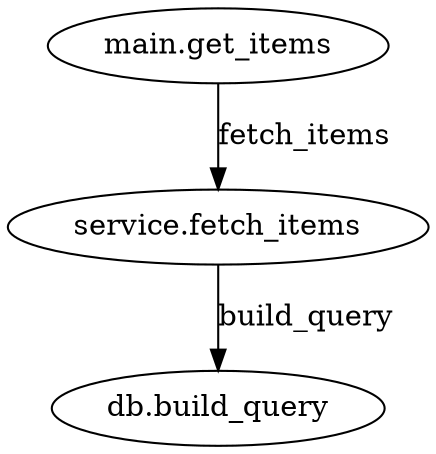

# codemole

**codemole** is a CLI tool that traces an API endpoint through your source code and generates sequence and class/flow diagrams.

---

## How it works

1. **Find** — Locates the endpoint handler in the codebase using framework-specific patterns (Spring annotations, FastAPI decorators, Gin route registrations).
2. **Parse** — For Java projects, launches an external Java parser (`java -jar java-parser.jar <source-root>`) as a subprocess. The parser performs a two-pass AST analysis (JavaParser + Symbol Solver), writes a structured JSON document to stdout, and exits. codemole reads and deserialises this JSON into a unified Intermediate Representation (IR).
3. **Traverse** — Builds a call graph from the IR and performs a BFS walk starting from the matched handler, skipping symbols loaded from an SQLite database (stdlib, framework helpers) — extensible without recompiling.
4. **Generate** — Produces a sequence diagram source (`.md`, Mermaid format) and a Graphviz class/flow diagram (`.dot`).
5. **Render** — Uses the built-in pure-Rust SVG renderer for sequence diagrams; calls `dot` (Graphviz) for class/flow diagrams when available, falling back to the built-in renderer otherwise. Also writes self-contained HTML viewers with pan/zoom support.

For Java projects that use interfaces (Spring `@Controller` + implementation class, OpenAPI-generated stubs, Feign clients, etc.), codemole detects that the matched class is an interface, finds the concrete implementation, and builds the call graph from the real business logic.

---

## Supported languages and frameworks

| Language | Framework | Patterns recognised |
|----------|-----------|---------------------|
| `java`   | Spring Boot | `@GetMapping`, `@PostMapping`, `@PutMapping`, `@DeleteMapping`, `@PatchMapping`, class-level `@RequestMapping` prefix |
| `python` | FastAPI     | `@app.get/post/put/delete/patch(...)`, `@router.*(...)` |
| `go`     | Gin         | `r.GET/POST/PUT/DELETE/PATCH(...)`, named group routes |

---

## Prerequisites

| Dependency | Required for | Minimum version |
|------------|-------------|-----------------|
| [Rust](https://rustup.rs/) + Cargo | Building codemole | 1.81 |
| [Java JDK](https://adoptium.net/) | Analysing Java projects (`--lang java`) | 17 |
| [Maven](https://maven.apache.org/) | Building the Java parser jar (one-time) | 3.6 |
| [Graphviz](https://graphviz.org/) | Class/flow diagram SVG (optional) | any recent |

Java and Maven are only needed if you intend to analyse Java source code. Graphviz is always optional (a built-in Rust renderer is used as fallback).

---

## Installation

### Quick install (all dependencies + binary)

**Linux / macOS:**
```bash
git clone https://github.com/javisarria/codemole
cd codemole
bash scripts/install-all.sh
```

**Windows (PowerShell — run as your normal user, not admin):**
```powershell
git clone https://github.com/javisarria/codemole
cd codemole
.\scripts\install-all.ps1
```

Both scripts install Graphviz, Java 17+, Maven, build the Java parser jar, and install the `codemole` binary.

### Manual installation

**1. Build and install the codemole binary** (requires Rust ≥ 1.81):

```bash
git clone https://github.com/javisarria/codemole
cd codemole
cargo install --path . --locked
```

**2. Build the Java parser jar** (required for `--lang java`):

```bash
cd parsers/java
mvn package -DskipTests
# produces: parsers/java/target/java-parser.jar
```

### Optional: install only external dependencies

If codemole is already installed and you only need to refresh the dependencies or jar:

```bash
bash scripts/install.sh          # Linux / macOS
.\scripts\install.ps1            # Windows
```

---

## Usage

```
codemole --lang <LANG> --endpoint <PATH> [--path <DIR>] [--output <DIR>] [--db <FILE>]
         [--java-parser <JAR>]
```

### Options

| Flag | Description | Default |
|------|-------------|---------|
| `--lang` | Language/framework: `java` \| `python` \| `go` | required |
| `--endpoint` | API endpoint to trace, e.g. `/api/users` | required |
| `--path` | Root directory of the source code to analyse | `.` (current dir) |
| `--output` | Base output directory; a sub-folder named after the endpoint is created inside | OS temp dir |
| `--db` | Path to the skip-symbols SQLite database (created on first run) | `<exe-dir>/symbols.db` |
| `--java-parser` | Path to `java-parser.jar` (required when `--lang java`) | `./parsers/java/target/java-parser.jar` |
| `--help` | Print help | |
| `--version` | Print version | |

### Examples

```bash
# Java / Spring Boot
codemole --lang java \
         --endpoint /api/users \
         --path ./my-spring-project \
         --java-parser ./parsers/java/target/java-parser.jar \
         --output ./diagrams

# Python / FastAPI
codemole --lang python --endpoint /items/{id} --path ./my-fastapi-project --output ./diagrams

# Go / Gin
codemole --lang go --endpoint /health --path ./my-gin-project --output ./diagrams
```

Path parameters are treated as wildcards — `/items/{id}` matches `/items/{item_id}` in FastAPI or `/items/:id` in Gin.

Output is written to `<output>/<endpoint-slug>/`. For example, `/api/users/{id}` → `./diagrams/api_users_id/`.

---

## Output files

Each run writes the following files inside the endpoint sub-folder:

| File | Contents |
|------|----------|
| `diagrams/sequence.md` | Mermaid `sequenceDiagram` source |
| `diagrams/classflow.dot` | Graphviz DOT digraph — class diagram (Java) or call-flow (Python/Go) |
| `diagrams/component.dot` | Graphviz DOT digraph — component/module diagram |
| `diagrams/dependency.dot` | Graphviz DOT digraph — package dependency diagram |
| `diagrams/dependency_metrics.txt` | Dependency coupling/cohesion metrics |
| `sequence.svg` | Rendered SVG — sequence diagram (built-in renderer) |
| `classflow.svg` | Rendered SVG — class diagram or call-flow (`dot` if available, else built-in) |
| `component.svg` | Rendered SVG — component diagram |
| `dependency.svg` | Rendered SVG — dependency diagram |
| `sequenceViewer.html` | Self-contained HTML viewer with embedded SVG and pan/zoom |
| `classflowViewer.html` | Self-contained HTML viewer with embedded SVG and pan/zoom |
| `componentViewer.html` | Self-contained HTML viewer with embedded SVG and pan/zoom |
| `dependencyViewer.html` | Self-contained HTML viewer with embedded SVG and pan/zoom |
| `svg-pan-zoom.min.js` | Pan/zoom library used by the viewers |

### Sample output — Mermaid sequence diagram

````md
sequenceDiagram
    participant "ItemController" as p0
    participant "ItemService"    as p1
    participant "ItemRepository" as p2

    activate p0
    p0->>p1: fetchItems()
    activate p1
    p1->>p2: buildQuery()
    activate p2
    p2-->>p1: List<Item>
    deactivate p2
    p1-->>p0: List<Item>
    deactivate p1
    deactivate p0
````

### Sample output — Graphviz DOT (Java class diagram)

```dot
digraph classflow {
  graph [rankdir=TB, bgcolor="white", splines=ortho];
  node [shape=none, margin=0];

  ItemController [label=<
    <TABLE ...>
      <TR><TD><B>ItemController</B></TD></TR>
      <TR><TD ALIGN="LEFT">+ fetchItems()</TD></TR>
    </TABLE>>];
  ItemService [label=<...>];
  ItemController -> ItemService [label="uses"];
}
```

### Sample output — Graphviz DOT (Python/Go call-flow)


```dot
digraph classflow {
  graph [rankdir=TB];
  N0 [label="main.get_items"];
  N1 [label="service.fetch_items"];
  N2 [label="db.build_query"];
  N0 -> N1 [label="fetch_items"];
  N1 -> N2 [label="build_query"];
}
```

---

## Skip-symbols database

codemole uses an SQLite database (`symbols.db`) to decide which function calls to skip during BFS traversal. The database is created automatically on the first run and seeded with built-in defaults for each language (stdlib calls, common framework helpers, logging utilities, etc.).

**You can extend or trim the list without recompiling** — use any SQLite client:

```bash
# Add a symbol to skip for Java
sqlite3 symbols.db \
  "INSERT INTO skip_symbols (language_id, category_id, symbol)
   SELECT l.id, c.id, 'myHelperMethod'
   FROM languages l, skip_categories c
   WHERE l.name='java' AND c.name='custom';"

# List all Java skip-symbols
sqlite3 symbols.db \
  "SELECT s.symbol FROM skip_symbols s
   JOIN languages l ON l.id = s.language_id
   WHERE l.name = 'java';"
```

### Schema

```
languages        id, name                         ("java", "python", "go")
skip_categories  id, name                         ("stdlib", "keywords", …)
skip_symbols     id, language_id, category_id, symbol
```

---

## SVG generation

SVG files are rendered using the best available tool:

- **Sequence diagram** — always rendered by the built-in pure-Rust renderer.
- **Class/flow diagram** — rendered by `dot` (Graphviz) when installed; falls back to the built-in renderer otherwise.

The built-in renderer features:
- Dynamic per-participant column widths (labels never overlap)
- BFS-level layout for flowcharts
- Grid layout for class diagrams
- Self-call loops rendered as rectangular arcs

---

## How it works internally

```
AST (por lenguaje)
 ↓
IR (común)
 ├── Modules
 ├── Types
 ├── Functions
 │    ├── calls
 │    └── cfg
 ↓
Diagramas:

Clases         → Types
Dependencias   → Modules + calls
Componentes    → Modules agrupados
Secuencia      → calls (+ opcional cfg)
CFG            → cfg
Flowchart      → cfg (simplificado)
```

### Java parser subprocess (`parsers/java/`)

For Java analysis, codemole delegates all AST work to an external fat-jar built with [JavaParser](https://javaparser.org/) and its Symbol Solver. The process runs in two passes:

1. **Pass 1 — Registration**: walks every `.java` file, builds a `Program` document (modules, types, function signatures). Resolves type hierarchy (extends/implements).
2. **Pass 2 — Body analysis**: re-uses the cached ASTs; processes method bodies to detect Spring endpoint annotations, register call sites, and build per-method Control-Flow Graphs (CFGs).

The parser writes a single JSON document to stdout — the `Program v1.0` contract — and exits. codemole reads this on stdin, deserialises it into a unified IR, and builds an indexed `Graph` (O(1) lookups by ID) for diagram generation.

```
codemole ──── java -jar java-parser.jar <source-root> ───→ stdout (JSON)
         ←─── Program v1.0 ──── Graph ──── diagrams
```

### Finder (`src/finder/`)

Language-specific modules scan source files with regex patterns to locate the endpoint annotation/route registration. For Java, class-level `@RequestMapping` prefixes are accumulated and combined with method-level mappings. When a matched class turns out to be an `interface`, the finder scans all other `.java` files for a `class X implements InterfaceName` declaration and resolves to the concrete implementation.

### Skip-symbols DB (`src/db/`)

On startup, `db::init` opens (or creates) `symbols.db`, ensures the schema exists, and seeds language-specific skip-symbol defaults on the first run. `db::load_skip_symbols` returns a `HashSet<String>` consumed by the BFS traversal.

### Call graph (`src/parser/`)

A definition index is built by scanning every source file for function/method declarations. From the entry point, BFS traversal extracts call sites from method bodies and resolves each callee name against the index, skipping any name present in the skip-symbols set.

### Diagrams (`src/diagram/`)

- `sequence.rs` — emits a PlantUML `@startuml` block with DFS-ordered participants, activation bars, and return arrows labelled by the callee's declared return type or expression.
- `classflow.rs` — emits a Graphviz DOT digraph: HTML-table record nodes grouped by class (Java) or simple labelled nodes with directed edges (Python/Go).

### Output & SVG renderer (`src/output/`)

`output::write_diagrams` writes `.puml` and `.dot` sources, then renders `sequence.svg` with the built-in Rust renderer and tries `dot` to render `classflow.svg` (falls back to built-in on failure). Finally, it generates `sequenceViewer.html` and `classflowViewer.html` by embedding the SVG into a viewer template with `svg-pan-zoom`.

---

## Project structure

```
codemole/
├── Cargo.toml
├── viewer/
│   ├── viewer.html              # HTML viewer template (embedded at compile time)
│   └── svg-pan-zoom.min.js      # Pan/zoom library (embedded at compile time)
├── parsers/
│   └── java/
│       ├── pom.xml              # Maven fat-jar project (JavaParser + Gson)
│       └── src/main/java/com/codemole/
│           ├── JavaASTParser.java   # Entry point — two-pass orchestrator
│           ├── ProgramBuilder.java  # Stateful IR accumulator (Program v1.0)
│           ├── SpringDetector.java  # Spring MVC annotation detection
│           └── cfg/
│               └── CfgBuilder.java  # Per-method CFG construction
├── scripts/
│   ├── install.sh / install.ps1         # Dependencies only (Graphviz, Java, Maven, jar)
│   └── install-all.sh / install-all.ps1 # Full install (above + Rust + codemole binary)
└── src/
    ├── main.rs                  # CLI entry (clap)
    ├── ir/
    │   └── mod.rs               # Unified IR — Program (JSON contract) + Graph (runtime)
    ├── db/
    │   └── mod.rs               # SQLite skip-symbols DB
    ├── finder/
    │   ├── mod.rs               # EntryPoint type + factory
    │   ├── spring.rs            # Java/Spring finder
    │   ├── fastapi.rs           # Python/FastAPI finder
    │   └── gin.rs               # Go/Gin finder
    ├── parser/
    │   ├── mod.rs               # Parser module exports
    │   ├── java_ir.rs           # Thin bridge: launch jar → deserialise JSON → Graph
    │   └── language.rs          # LanguageAnalyzer trait + Python/Go impls
    ├── diagram/
    │   ├── mod.rs
│   │   ├── sequence.rs          # PlantUML sequence diagram
│   │   └── classflow.rs         # Graphviz DOT class diagram / call-flow
│   └── output/
│       ├── mod.rs               # File writer + external renderer calls
│       └── svg.rs               # Native fallback SVG renderer
└── README.md
```

---

## Limitations

- Regex-based parsing — does not handle heavily minified, generated, or macro-expanded code.
- Indirect calls (reflection, dynamic dispatch beyond interface resolution) are not traced.
- Multi-module Maven/Gradle projects: implementations in a different module/jar than the interface will fall back to the interface location.
- Python: only top-level `def`/`async def` functions are traced (class methods inside classes are matched by method name only).
- Go: only functions with a single return path are reliably traced; complex closures may be missed.
